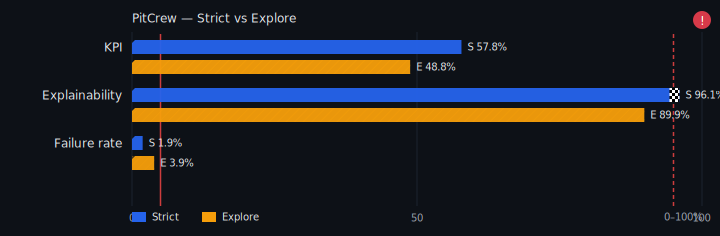
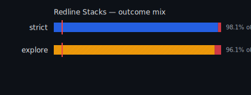
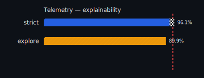

### SISSA PitCrew — Live Status

   

More visuals

Nightly and on every PR, PitCrew runs the offline battle‑test (scenarios → simulator strict/explore → evaluator) and refreshes these badges. PASS/HOLD follows the evaluator’s gates (failure rates and explainability thresholds). Details: see `mech_out/mechanic_kpi.json` and CI job summaries.
